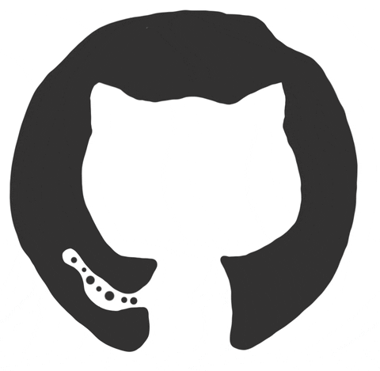
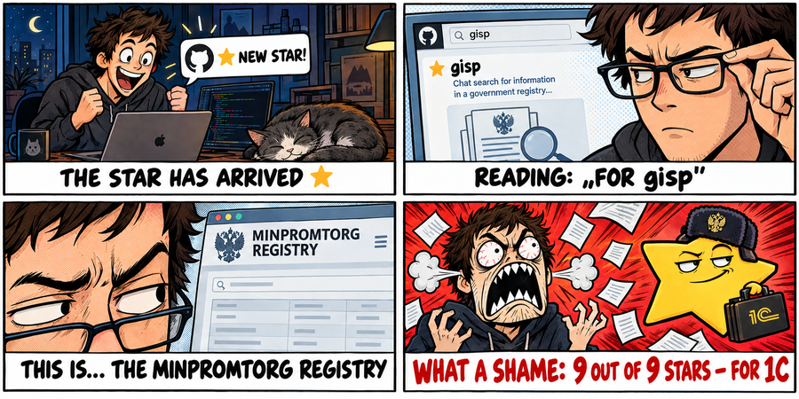
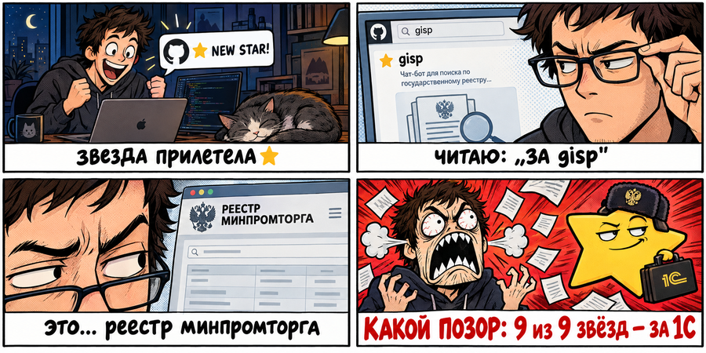

# Hi, I'm Mihail (0x3654)

<b><a href="#привет-я-михаил-0x3654">🇷🇺 Русская версия</a></b>

  <picture>
    <source media="(prefers-color-scheme: dark)" srcset="assets/octo-dark.gif">
    
  </picture>

📍 <b>Moscow → Tbilisi</b> | Business Analyst (1C/ERP) by day, macOS & infra tinkerer by night 
Dropped an AirPod in coffee once. ☕🎧

  <picture>
    <source media="(prefers-color-scheme: dark)" srcset="assets/typing-dark.gif">
    
  </picture>

  
  
  

  

<h3 align="center">🌟 First star — and it's for 1C. What a shame. 🤦</h3>

  

---

## Current Projects

<!-- projects:start -->
### ⬇️ [vdl](https://github.com/0x3654/vdl) — [vdl.0x3654.com](https://vdl.0x3654.com)
Universal video downloader: an iPhone Shortcut → one GET → the video lands straight in Photos.
- cobalt engine behind a Go keeper (pure stdlib): Twitter/X resolver ported from my scraping skill (queryId rotation, best-bitrate mp4), SSRF filter, rate limits, resolve cache
- cookies managed in Telegram (LRU store, expiry checks with alerts) — a fresh cookie restarts cobalt through a docker-socket hook, no cron
- the iOS Shortcut is built from a repo template and served with the right type/filename; `/f` proxy because iOS follows no redirects
- one ansible role: compose + split nginx + certbot; CI builds the image to ghcr

### 🖥️ [ansible](https://github.com/0x3654/ansible)
Everything as code: 4 VPS + homelab (26 TB, ~20 containers) + 2 Macs + router.
- Semaphore CI + GitHub Actions: push → auto-deploy by role
- nightly Mac-to-Mac rsync sync with disk guards and Telegram reports
- VPN stack (Xray/Reality, AmneziaWG), frp tunnel through CGNAT, Beszel + Watchtower

### 🧰 [v8dock](https://github.com/0x3654/v8dock)
1C:Enterprise dev stack in Docker on Apple Silicon.
- PostgreSQL 18.4-1.1C (native arm64, tuned per Postgres Pro appendix) + 8.3/8.5 clusters, 8.2-era playground in `dev/82`
- 8.5.4 beta cluster — a native arm64 build with no Rosetta; the native client proven on M5 Max and A18 Pro, closing the 1C-crashes-on-A18 question
- headless `fetch-release.py`: logs into releases.1c.ru, picks a mirror, verifies SHA-512 — dists without a single click
- ships an AI skill (1c-ib): headless create/copy/dump/restore of infobases, live config import/export, sessions — the same commands from any agent's shell
- community-license automation through the native platform API (a legal equivalent of a paid tool); base images on Docker Hub, `bootstrap.sh` one-liner

### ⚙️ [lazy1c](https://github.com/0x3654/lazy1c) — v0.0.3
A lazygit-style TUI for 1C:Enterprise cluster administration.
- own transport for the RAS protocol — no working open implementation existed
- reverse-engineered the undocumented MMC protocol of ragent (8.2 and 8.3): sessions, terminate, cluster polling 2300 ms → 232 ms (10×)
- auto-detects the ragent generation (8.2 vs 8.3) — covered by TCP-fake engine tests and a 17-case filter matrix
- one-command install (curl / PowerShell), binaries for macOS/Linux/Windows via CI

### 📺 [lampa-plugins](https://github.com/0x3654/lampa-plugins)
Plugin pack for the [Lampa](https://lampa.mx) media player + the Go services behind it — deployed as a self-hosted player clone that configures itself from one URL.
- **Torrent Send** — copy/open magnet from the long-press menu, one-off releases straight into the auto-feed (→ Plex library)
- **top.js** — «Top» screens: TMDB trends × torrent charts (NNM-Club, RUTOR, Jackett) with quality/voice filters, junk filtering, dedup; Go backend (scratch image, multi-arch CI → ghcr)
- **plex-sync** — watch-state sync Lampa ↔ Plex account: OAuth PIN, QR activation, background re-sync; 348 films / 672 episodes imported on day one
- **t.js** — one-URL bootstrap: installs the plugins and applies settings on a fresh Lampa
- **offline downloads**: «Download (offline)» straight from a release card → the on-device engine, with a downloads manager in settings
- the whole thing runs as a **privacy-hardened clone**: third-party metrics/geo/ads and account-email leaks cut before leaving the page

### 🎵 [Yandex Music notch player](https://github.com/0x3654/PulseSync-mod/tree/moro/dev122) — fork of [PulseSync-LLC/PulseSync-mod](https://github.com/PulseSync-LLC/PulseSync-mod)
Full player living in the MacBook notch. Branches: [dev119](https://github.com/0x3654/PulseSync-mod/tree/moro/dev119) · [dev120](https://github.com/0x3654/PulseSync-mod/tree/moro/dev120) · [dev121](https://github.com/0x3654/PulseSync-mod/tree/moro/dev121) · [dev122](https://github.com/0x3654/PulseSync-mod/tree/moro/dev122) — real ports of four client versions, not the upstream version spoof.
- capsule → hover panel: likes, shuffle/repeat, seek, volume wheel, search right in the notch
- native track menus, artist/track links, multi-display support
- macOS **and Windows**: one-command installers (curl / PowerShell), taskbar thumbnails, wasapi output
- informed update flow: when a new client version lands, the app **asks before touching the mod** — checks the fork for a matching port branch and offers the choice; upstream auto-update muted
- e2e-tested via CDP (101/0); porting playbook documented per release

### ⌨️ [TitanElite2RUkeyboard](https://github.com/0x3654/TitanElite2RUkeyboard) — 🆕 fresh
Russian ЙЦУКЕН for the Unihertz Titan 2 Elite physical keyboard — the stock IME, patched at the smali level.
- the stock ru-layout leaves 6 Cyrillic letters physically unreachable — reverse-engineered the IME (jadx) to prove it's by design
- patched clone of the stock IME (apktool + smali edits): full ЙЦУКЕН, multitap tails (P з→х→ъ, L д→ж→э, M ь→б→ю…), long-press = capitals
- Alt+Space flips RU↔EN on the fly, wired through the IME internals
- also cracked the flick-typing whitelist (firmware RRO, root-only) — why any clone IME gets cut off
- compared against BlackBerry's own RU layouts (Passport/Priv): the Titan patch is the only one with all 33 letters reachable
- layout diagrams, docker build scripts, EN/RU readme

### 📡 [nnm-rss](https://github.com/0x3654/nnm-rss)
Personal RSS for a private tracker — reverse engineering turned a script into a full self-hosted service (Go, scratch container).
- reverse-engineered the tracker's announce/passkey model (532 live torrents, a matrix of probe requests): every download gets its own unique passkey — the service hands out clean btih magnets instead
- DHT .torrent resolver: hash → real torrent file on demand, cached forever
- release pages with posters and ratings (Кинопоиск, IMDb, TMDB, MyAnimeList)
- 4 feed flavors per profile, regex filter presets (quality / voice studios), dedup «one film = one entry» with quality-upgrade memory (1080p → 4K arrives, repeats don't)
- bcrypt auth, session rotation, PRG forms — a tiny product, not a script

### 🎮 [ChargeSense](https://github.com/0x3654/chargesense) — v1.0.2
DualSense battery in the macOS menu bar — and the controller itself becomes the indicator.
- HID reverse engineering: output report 0x31 (BT, CRC32) / 0x02 (USB) per the Linux hid-playstation driver
- the write channel survives USB↔Bluetooth hot-swaps (re-attach race + 1 s watchdog) — the indication never goes silent
- lightbar color zones, breathing while charging, 5 player-LEDs as a charge gauge
- RU/EN localization, launch at login, demo mode with rumble; MIT, DMG release via CI

### 🚦 [zai-cursor-limit](https://github.com/0x3654/zai-cursor-limit) — v1.0.2
Cursor/VSCode extension — Z.ai GLM Coding Plan quota traffic light.
- status bar `[:] NN%` for the bigger of the two windows (5h / weekly)
- green → yellow → red thresholds, optional title bar tint
- one-click install from GitHub Releases (CI-built vsix)

### 🔍 [GISP](https://github.com/0x3654/gisp)
Chat-style search over the Russian Ministry of Industry product register.
- hybrid search: strict filters + semantic mode (RAG, embeddings)
- nightly data pipeline: downloader → import → embeddings (Ansible/Semaphore, no in-container cron)
- ships with a 1C:Enterprise 8.2 integration — external data processor calling the API

### 📱 [untilwall](https://github.com/0x3654/untilwall)
Auto-updating calendar lock screen wallpaper for phones and tablets.

<!-- projects:end -->

---

## On the Workbench *(links pending — repos not public yet)*

### 📮 social-poster *(closed beta)*
Telegram-driven X posting pipeline: draft → preview card → post → metrics, with scheduling and digests (Bot API, containerized, 33 tests).

### 📡 meshtastic *(Tbilisi LoRa mesh)*
Two Heltec V3 nodes revived for the city mesh — they arrived dead (wrong region, TX off).
- fixed: EU_868 / LONG_FAST, flashed, fixed position on a 13th-floor window — 20+ live neighbours across the hilly city (45+ seen), ~24 relays/hour
- stability root-caused over two nights of telemetry (WiFi + clean power + no phone BLE = zero spontaneous reboots)
- network geography mapped (Leaflet + direct-visibility rings), SNR leaderboard, MQTT ghosts identified
- permanent WiFi monitoring with CSV logs and a daily Telegram digest

### 🪟 md-preview-fix
Cursor/VSCode: the markdown preview hijacking the focused tab (worst case — wiping a running AI-chat tab), root cause traced to the upstream previewManager placement logic and A/B-proven on a dev build — reported upstream with a repro.

### 📺 lampa-app *(work in progress)*
Own multi-platform shell for the Lampa player — SwiftUI + WKWebView, one codebase for tvOS/iOS/macOS.
- tvOS renders the web through a **private WebKit bridge** (public WebKit doesn't exist on tvOS) — runs on real Apple TV hardware
- local reverse proxy + TorrServerKit engine inside; offline mode like Plex: static mirror, downloads with an LRU quota
- third-party tracking/ads cut at the shell level — requests never leave the app

---

## Latest Releases

<!-- latest-releases:start -->
- [**lazy1c** v0.0.3](https://github.com/0x3654/lazy1c/releases/tag/v0.0.3) — 2026-10-07
- [**chargesense** v1.0.2](https://github.com/0x3654/chargesense/releases/tag/v1.0.2) — 2026-09-22
- [**zai-cursor-limit** v1.0.2](https://github.com/0x3654/zai-cursor-limit/releases/tag/v1.0.2) — 2026-09-16
- [**better-osd** v3.7.0](https://github.com/0x3654/better-osd/releases/tag/v3.7.0) — 2026-09-14
- [**Nightfall** v1](https://github.com/0x3654/Nightfall/releases/tag/v1) — 2026-09-14
<!-- latest-releases:end -->

*auto-updated by a GitHub Action — the freshest tags land here on their own*

---

## Popular Repos

<!-- popular-repos:start -->
| Repo | ⭐ | ⑂ | clones/14d | about |
|---|---|---|---|---|
| [v8dock](https://github.com/0x3654/v8dock) | 7 | 1 | 26 | 1C:Enterprise dev stack in Docker on Apple Silicon: PostgreSQL (1C bui |
| [lampa-plugins](https://github.com/0x3654/lampa-plugins) | 1 | 0 | 284 | Plugins for the Lampa media app — top, transmission-send, t.js — plus  |
| [chargesense](https://github.com/0x3654/chargesense) | 1 | 0 | 18 | DualSense battery in the macOS menu bar — and the controller itself be |
| [gisp](https://github.com/0x3654/gisp) | 1 | 0 | 8 | Поиск по реестру российской промышленной продукции Минпромторга в форм |
| [ansible](https://github.com/0x3654/ansible) | 0 | 0 | 143 | Infrastructure as Code: 4 VPS + homelab + 2 Macs — Ansible roles, Sema |
<!-- popular-repos:end -->

*auto-ranked daily: stars → forks → unique clones (14d)*

---

## Shipped

### 🍏 [better-osd](https://github.com/0x3654/better-osd) — v3.7.0
Classic volume/brightness OSD for macOS — fork of [zmlabs/better-osd](https://github.com/zmlabs/better-osd), 5 releases, Sparkle updates.
- keyboard backlight OSD (private CoreBrightness)
- DDC brightness for external monitors, real zero via gamma
- built-in display off with a hotkey (private SkyLight API)
- **merged upstream**: all four PRs (#16–#19) landed in [zmlabs/better-osd v3.3.0](https://github.com/zmlabs/better-osd/releases/tag/v3.3.0) 🎉 — two more (#22 display-off, #23 localization) were politely declined: display-off stays a fork-exclusive

### 🌙 [Nightfall](https://github.com/0x3654/Nightfall) — v1
Dark mode sync macOS → Parallels Windows VMs — fork of [r-thomson/Nightfall](https://github.com/r-thomson/Nightfall) (upstream inactive), own releases.

### 🤖 [telegram](https://github.com/0x3654/telegram)
MTProto → REST API & MCP server for LLMs.

---

## Open Source

PRs & reports:
- [lazydocker#839](https://github.com/jesseduffield/lazydocker/pull/839) + [gocui#107](https://github.com/jesseduffield/gocui/pull/107) — selected-line contrast
- [better-osd #16](https://github.com/zmlabs/better-osd/pull/16), [#17](https://github.com/zmlabs/better-osd/pull/17), [#18](https://github.com/zmlabs/better-osd/pull/18), [#19](https://github.com/zmlabs/better-osd/pull/19) — clamshell/DDC, keyboard backlight, volume sound, modifiers · **merged** into upstream v3.3.0 🎉
- [better-osd #22](https://github.com/zmlabs/better-osd/pull/22) + [#23](https://github.com/zmlabs/better-osd/pull/23) — display-off, localization · closed upstream (out of scope / DIY), display-off lives on in the fork
- [PulseSync-mod #22](https://github.com/PulseSync-LLC/PulseSync-mod/pull/22), [#24](https://github.com/PulseSync-LLC/PulseSync-mod/pull/24) — Yandex Music mod, macOS fixes (closed upstream; lives on in the fork)
- [tailscale#17089](https://github.com/tailscale/tailscale/issues/17089) — cloned Mac identity: diagnosis + workaround

Reverse engineering for fun: undocumented 1C cluster protocols (RAS/MMC), Huawei ONT web login, X GraphQL.

---

## Currently Exploring

- 🔧 DevOps & CI/CD pipelines — automating everything that moves
- 🤖 AI agents and MCP servers
- 📦 Infrastructure as code

---

## Fun Facts

- ☕🎧 Dropped an AirPod in coffee. Once.
- 🐈 Cats are my pair programmers — they mostly sleep through the code reviews

---

## Philosophy

> "Impossible is temporary"! 😅

---

## GitHub Stats

  <picture>
    <source media="(prefers-color-scheme: dark)" srcset="https://github-readme-stats.vercel.app/api/top-langs/?username=0x3654&layout=compact&hide_border=true&langs_count=8&theme=dark">
    
  </picture>

  <picture>
    <source media="(prefers-color-scheme: dark)" srcset="https://streak-stats.demolab.com?user=0x3654&hide_border=true&theme=dark">
    
  </picture>

  <picture>
    <source media="(prefers-color-scheme: dark)" srcset="https://raw.githubusercontent.com/0x3654/0x3654/snake-output/dist/snake_dark.gif">
    
  </picture>

---

## Connect with Me

- [X (Twitter)](https://x.com/0x3654) — let's chat about DevOps, AI, or cats!

---

[↑ Back to top](#hi-im-mihail-0x3654)

---

# Привет, я Михаил (0x3654)

<b><a href="#hi-im-mihail-0x3654">🇬🇧 English version</a></b>

  <picture>
    <source media="(prefers-color-scheme: dark)" srcset="assets/octo-dark.gif">
    
  </picture>

📍 <b>Москва → Тбилиси</b> | днём — бизнес-аналитик 1С/ERP, ночью — докручиваю маки и инфраструктуру 
Однажды утопил AirPod в кофе. ☕🎧

  <picture>
    <source media="(prefers-color-scheme: dark)" srcset="assets/typing-dark.gif">
    
  </picture>

  
  
  

  

<h3 align="center">🌟 Первая звезда — и та из-за 1С. Какой позор. 🤦</h3>

  

---

## Текущие проекты

<!-- projects:start -->
### ⬇️ [vdl](https://github.com/0x3654/vdl) — [vdl.0x3654.com](https://vdl.0x3654.com)
Универсальный видео-загрузчик: шорткат айфона → один GET → видео сразу в Фото.
- движок cobalt под Go-keeper'ом (чистый stdlib): твиттер/X-резолвер портирован из моего скилла (ротация queryId, mp4 по лучшему битрейту), SSRF-фильтр, rate-limit, кэш резолвов
- куки-менеджер в Telegram (LRU-стор, чекер протухания с алертами) — свежая кука перезапускает cobalt через docker-сокет-хук, без кронов
- шорткат iOS собирается из шаблона репо и отдаётся с правильным типом/именем файла; `/f`-прокси — потому что iOS не следует за 302
- одна ansible-роль: compose + сплит-nginx + certbot; CI собирает образ в ghcr

### 🖥️ [ansible](https://github.com/0x3654/ansible)
Всё как код: 4 VPS + homelab (26 ТБ, ~20 контейнеров) + 2 мака + роутер.
- Semaphore CI + GitHub Actions: пуш → авто-деплой по ролям
- ночной rsync-синк маков с гвардиями диска и Telegram-отчётами
- VPN-стек (Xray/Reality, AmneziaWG), frp-туннель через CGNAT, Beszel + Watchtower

### 🧰 [v8dock](https://github.com/0x3654/v8dock)
Дев-стек 1С в Docker на Apple Silicon.
- PostgreSQL 18.4-1.1C (нативный arm64, тюнинг по Приложению K Postgres Pro) + кластеры 8.3/8.5, полигон 8.2 в `dev/82`
- кластер 8.5.4 (бета) — нативная arm64-сборка без Rosetta; нативный клиент проверен на M5 Max и A18 Pro — вопрос крашей 1С на A18 закрыт
- headless `fetch-release.py`: логин на releases.1c.ru, выбор зеркала, проверка SHA-512 — дистрибутивы без единого клика
- в репо живёт AI-скилл (1c-ib): headless создание/копии/дампы/восстановление баз, живой конфиг, сеансы — одни команды из шелла любого агента
- автоматизация комьюнити-лицензий через штатный API платформы (легальный аналог платной обработки); образы на Docker Hub, `bootstrap.sh` одной командой

### ⚙️ [lazy1c](https://github.com/0x3654/lazy1c) — v0.0.3
TUI-консоль администрирования кластеров 1С в духе lazygit.
- собственный транспорт протокола RAS — рабочих открытых реализаций не существовало
- реверс недокументированного MMC-протокола ragent (8.2 и 8.3): сеансы, terminate, опрос кластера 2300 мс → 232 мс (10×)
- сам распознаёт поколение ragent (8.2/8.3) — покрыто TCP-фейками движка и матрицей из 17 кейсов фильтров
- установка одной командой (curl / PowerShell), бинарники macOS/Linux/Windows через CI

### 📺 [lampa-plugins](https://github.com/0x3654/lampa-plugins)
Пакет плагинов для плеера [Lampa](https://lampa.mx) + Go-сервисы — развёрнут как собственный клон плеера, настраивающийся одной ссылкой.
- **Torrent Send** — копировать/открыть магнет из меню долгого нажатия, разовые раздачи сразу в авто-ленту (→ библиотека Plex)
- **top.js** — экраны «Топ»: тренды TMDB × топы трекеров (NNM-Club, RUTOR, Jackett), фильтры качества/озвучки, отсев мусора, дедуп; Go-бэкенд (scratch-образ, multi-arch CI → ghcr)
- **plex-sync** — синк статуса просмотра Lampa ↔ аккаунт Plex: OAuth PIN, QR-активация, фоновая досинхронизация; 348 фильмов / 672 серии импортировано в первый день
- **t.js** — бутстрап одной ссылкой: ставит плагины и применяет настройки на чистой Lampa
- **офлайн-загрузки**: «Скачать (офлайн)» прямо из карточки раздачи → в движок на устройстве, менеджер загрузок в настройках
- всё живёт на **приватном клоне**: чужие метрика/гео/реклама и утечки email/account вырезаются до выхода из страницы

### 🎵 [Нотч-плеер Яндекс Музыки](https://github.com/0x3654/PulseSync-mod/tree/moro/dev122) — форк [PulseSync-LLC/PulseSync-mod](https://github.com/PulseSync-LLC/PulseSync-mod)
Полноценный плеер в вырезе MacBook. Ветки: [dev119](https://github.com/0x3654/PulseSync-mod/tree/moro/dev119) · [dev120](https://github.com/0x3654/PulseSync-mod/tree/moro/dev120) · [dev121](https://github.com/0x3654/PulseSync-mod/tree/moro/dev121) · [dev122](https://github.com/0x3654/PulseSync-mod/tree/moro/dev122) — настоящие порты четырёх версий клиента, не спуф версии апстрима.
- капсула → панель по ховеру: лайки, шаффл/повтор, перемотка, громкость колесом, поиск прямо в нотче
- родные меню трека, ссылки на артиста/трек, мульти-мониторы
- macOS **и Windows**: установка одной командой (curl / PowerShell), таскбар-превью, вывод звука WASAPI
- осмысленное обновление: при выходе новой версии клиента приложение **спрашивает, затирать мод или нет**, проверяет в форке ветку порта и предлагает выбор; канал автообновлений апстрима заглушен
- e2e через CDP (101/0); методика порта документируется на каждый релиз

### ⌨️ [TitanElite2RUkeyboard](https://github.com/0x3654/TitanElite2RUkeyboard) — 🆕 свежак
Русский ЙЦУКЕН для физической клавиатуры Unihertz Titan 2 Elite — родной IME, пропатченный на уровне смали.
- стоковая ру-раскладка оставляла 6 кириллических букв физически недостижимыми — реверс IME (jadx) доказал: by design
- патч клона родного IME (apktool + правки смали): полный ЙЦУКЕН, мультитап-хвосты (P з→х→ъ, L д→ж→э, M ь→б→ю…), лонгпресс = заглавные
- Alt+Space переключает RU↔EN на лету, вшито через внутренности IME
- заодно вскрыт белый список flick-typing (прошивочный RRO, только рут) — почему любой IME-клон отсекается
- сверено с ру-раскладками самих BlackBerry (Passport/Priv): патч Титана — единственная схема, где достижимы все 33 буквы
- схемы раскладок, сборка в docker, README EN+RU

### 📡 [nnm-rss](https://github.com/0x3654/nnm-rss)
Персональный RSS для закрытого трекера — реверс превратил скрипт в полноценный самохостящийся сервис (Go, scratch-контейнер).
- реверс модели анонсов/passkey трекера (532 живых торрента, матрица проб анонсов): у каждого скачивания свой уникальный passkey — сервис раздаёт чистые btih-магниты
- DHT-резолвер .torrent: хэш → настоящий торрент-файл по требованию, кэш навсегда
- страницы раздач с постерами и рейтингами (Кинопоиск, IMDb, TMDB, MyAnimeList)
- 4 ленты на профиль, пресеты регэксп-фильтров (качество / озвучки), дедуп «фильм = одна позиция» с памятью апгрейдов (1080p → 4K придёт, повтор — нет)
- bcrypt, ротация сессий, PRG-формы — маленький продукт, а не скрипт

### 🎮 [ChargeSense](https://github.com/0x3654/chargesense) — v1.0.2
Заряд DualSense в меню-баре macOS — и сам контроллер становится индикатором.
- реверс HID: output-отчёт 0x31 (BT, CRC32) / 0x02 (USB) по раскладке драйвера hid-playstation
- канал записи переживает переключение USB↔Bluetooth (гонка переподключения + watchdog 1 с) — индикация не замолкает
- цветовые зоны подсветки, «дыхание» на зарядке, 5 player-LED как шкала заряда
- RU/EN-локализация, автозапуск, демо-режим с вибрацией; MIT, DMG-релиз через CI

### 🚦 [zai-cursor-limit](https://github.com/0x3654/zai-cursor-limit) — v1.0.2
Расширение Cursor/VSCode — светофор квот Z.ai GLM Coding Plan.
- статус-бар `[:] NN%` — большее из двух окон (5ч / неделя)
- пороги зелёный → жёлтый → красный, опциональная подкраска тайтл-бара
- установка в один клик из GitHub Releases (CI-сборка vsix)

### 🔍 [GISP](https://github.com/0x3654/gisp)
Чат-поиск по реестру промышленной продукции Минпромторга.
- гибридный поиск: строгие фильтры + семантический режим (RAG, эмбеддинги)
- ночной пайплайн данных: downloader → import → embeddings (Ansible/Semaphore, без cron в контейнерах)
- в комплекте интеграция с 1С:Предприятие 8.2 — внешняя обработка поверх API

### 📱 [untilwall](https://github.com/0x3654/untilwall)
Автообновляемые обои-календарь для локскрина телефонов и планшетов.

<!-- projects:end -->

---

## Последние релизы

<!-- latest-releases:start -->
- [**lazy1c** v0.0.3](https://github.com/0x3654/lazy1c/releases/tag/v0.0.3) — 2026-10-07
- [**chargesense** v1.0.2](https://github.com/0x3654/chargesense/releases/tag/v1.0.2) — 2026-09-22
- [**zai-cursor-limit** v1.0.2](https://github.com/0x3654/zai-cursor-limit/releases/tag/v1.0.2) — 2026-09-16
- [**better-osd** v3.7.0](https://github.com/0x3654/better-osd/releases/tag/v3.7.0) — 2026-09-14
- [**Nightfall** v1](https://github.com/0x3654/Nightfall/releases/tag/v1) — 2026-09-14
<!-- latest-releases:end -->

*блок обновляется автоматически GitHub Action'ом*

---

## Популярные репозитории

<!-- popular-repos:start -->
| Repo | ⭐ | ⑂ | clones/14d | about |
|---|---|---|---|---|
| [v8dock](https://github.com/0x3654/v8dock) | 7 | 1 | 26 | 1C:Enterprise dev stack in Docker on Apple Silicon: PostgreSQL (1C bui |
| [lampa-plugins](https://github.com/0x3654/lampa-plugins) | 1 | 0 | 284 | Plugins for the Lampa media app — top, transmission-send, t.js — plus  |
| [chargesense](https://github.com/0x3654/chargesense) | 1 | 0 | 18 | DualSense battery in the macOS menu bar — and the controller itself be |
| [gisp](https://github.com/0x3654/gisp) | 1 | 0 | 8 | Поиск по реестру российской промышленной продукции Минпромторга в форм |
| [ansible](https://github.com/0x3654/ansible) | 0 | 0 | 143 | Infrastructure as Code: 4 VPS + homelab + 2 Macs — Ansible roles, Sema |
<!-- popular-repos:end -->

*авто-ранжирование раз в сутки: звёзды → форки → уникальные клоны (14 дней)*

---

## В работе *(ссылки — после публикации)*

### 📮 social-poster *(закрытая бета)*
Пайплайн постинга в X из Telegram: черновик → карточка-превью → пост → метрики, отложенные и дайджесты (Bot API, контейнер, 33 теста).

### 📡 meshtastic *(LoRa-mesh Тбилиси)*
Две ноды Heltec V3 подняты для городского mesh — приехали мёртвыми (не тот регион, передатчик выключен).
- выставлено EU_868 / LONG_FAST, прошивка обновлена, fixed position на окне 13-го этажа — 20+ живых соседей через холмистый город (45+ в базе), ~24 ретрансляции/час
- стабильность вычислена за две ночи телеметрии (WiFi + чистое питание + без BLE телефона = ноль спонтанных рестартов)
- география сети размечена (Leaflet + кольца прямой видимости), SNR-лидерборд, MQTT-призраки опознаны
- постоянный мониторинг по WiFi с CSV-логами и суточным дайджестом в Telegram

### 🪟 md-preview-fix
Cursor/VSCode: markdown-превью угоняет вкладку в фокусе (худший случай — затирает вкладку ИИ-чата посреди выполнения), первопричина найдена в логике placement апстрим-previewManager и доказана A/B на dev-сборке — зарепорчено вверх с репро.

### 📺 lampa-app *(в работе)*
Своя мультиплатформенная оболочка плеера Lampa — SwiftUI + WKWebView, один код на tvOS/iOS/macOS.
- tvOS рендерит веб через **приватный мост WebKit** (публичного WebKit на tvOS не существует) — работает на железном Apple TV
- локальный реверс-прокси + движок TorrServerKit внутри; офлайн-режим как в Plex: зеркало статики, загрузки с LRU-квотой
- чужой трекинг/реклама режутся на уровне оболочки — запросы не покидают приложение

---

## Выпущено

### 🍏 [better-osd](https://github.com/0x3654/better-osd) — v3.7.0
Классический OSD громкости/яркости для macOS — форк [zmlabs/better-osd](https://github.com/zmlabs/better-osd), 5 релизов, Sparkle-обновления.
- OSD подсветки клавиатуры (приватный CoreBrightness)
- DDC-яркость внешних мониторов, настоящий ноль через гамму
- выключение встроенного дисплея по хоткею (приватный SkyLight API)
- **влито в апстрим**: все четыре PR (#16–#19) вошли в [zmlabs/better-osd v3.3.0](https://github.com/zmlabs/better-osd/releases/tag/v3.3.0) 🎉 — ещё два (#22 display-off, #23 локализация) вежливо отклонены: display-off остаётся форк-эксклюзивом

### 🌙 [Nightfall](https://github.com/0x3654/Nightfall) — v1
Синк тёмной темы macOS → Windows-VM Parallels — форк [r-thomson/Nightfall](https://github.com/r-thomson/Nightfall) (апстрим неактивен), свои релизы.

### 🤖 [telegram](https://github.com/0x3654/telegram)
MTProto → REST API и MCP-сервер для LLM.

---

## Опенсорс

PR и репорты:
- [lazydocker#839](https://github.com/jesseduffield/lazydocker/pull/839) + [gocui#107](https://github.com/jesseduffield/gocui/pull/107) — читаемость выбранной строки
- [better-osd #16](https://github.com/zmlabs/better-osd/pull/16), [#17](https://github.com/zmlabs/better-osd/pull/17), [#18](https://github.com/zmlabs/better-osd/pull/18), [#19](https://github.com/zmlabs/better-osd/pull/19) — clamshell/DDC, подсветка клавиатуры, звук громкости, модификаторы · **влито** в апстрим v3.3.0 🎉
- [better-osd #22](https://github.com/zmlabs/better-osd/pull/22) + [#23](https://github.com/zmlabs/better-osd/pull/23) — display-off, локализация · закрыты апстримом (вне скопа / «сделаю сам»), display-off живёт в форке
- [PulseSync-mod #22](https://github.com/PulseSync-LLC/PulseSync-mod/pull/22), [#24](https://github.com/PulseSync-LLC/PulseSync-mod/pull/24) — мод Яндекс Музыки, фиксы macOS (закрыты апстримом; живёт в форке)
- [tailscale#17089](https://github.com/tailscale/tailscale/issues/17089) — клон личности Mac: диагностика + воркаэраунд

Реверс-инжиниринг для удовольствия: недокументированные протоколы кластеров 1С (RAS/MMC), веб-логин Huawei ONT, X GraphQL.

---

## Копаю сейчас

- 🔧 DevOps и CI/CD — автоматизация всего, что движется
- 🤖 AI-агенты и MCP-серверы
- 📦 Инфраструктура как код

---

## Факты

- ☕🎧 Утопил AirPod в кофе. Один раз.
- 🐈 Коты — мои парные программисты: код-ревью проходят во сне

---

## Философия

> «Невозможно - это не навсегда»! 😅

---

## Статистика GitHub

  <picture>
    <source media="(prefers-color-scheme: dark)" srcset="https://github-readme-stats.vercel.app/api/top-langs/?username=0x3654&layout=compact&hide_border=true&langs_count=8&theme=dark">
    
  </picture>

  <picture>
    <source media="(prefers-color-scheme: dark)" srcset="https://streak-stats.demolab.com?user=0x3654&hide_border=true&theme=dark">
    
  </picture>

  <picture>
    <source media="(prefers-color-scheme: dark)" srcset="https://raw.githubusercontent.com/0x3654/0x3654/snake-output/dist/snake_dark.gif">
    
  </picture>

---

## Связь

- [X (Twitter)](https://x.com/0x3654) — поговорим про DevOps, ИИ или котов!

---

[↑ К началу](#привет-я-михаил-0x3654)

